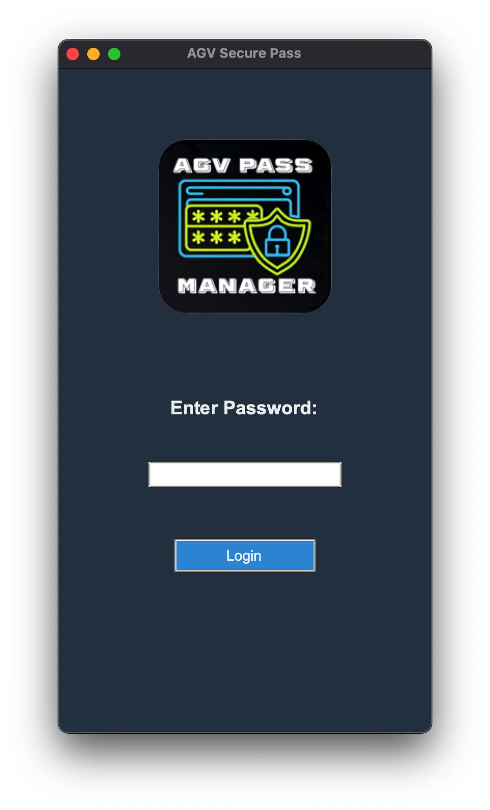
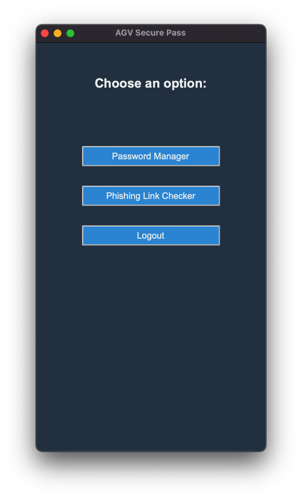
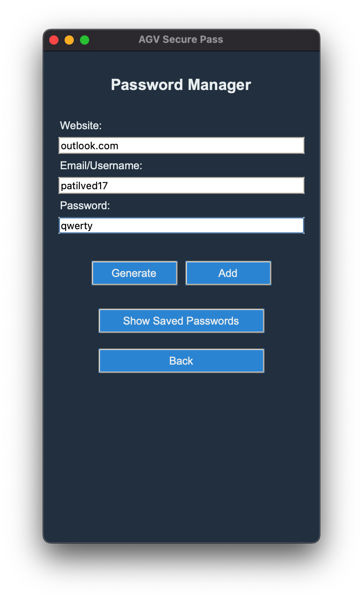
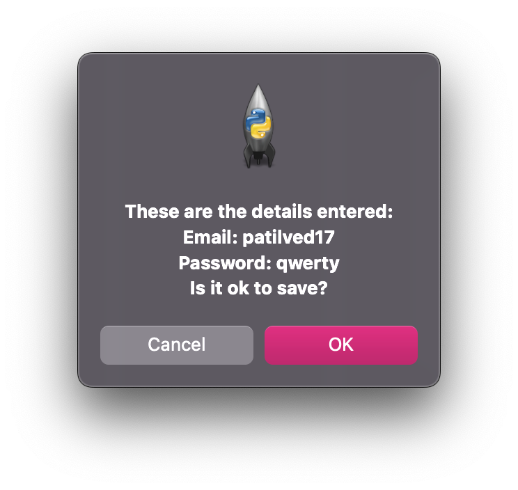
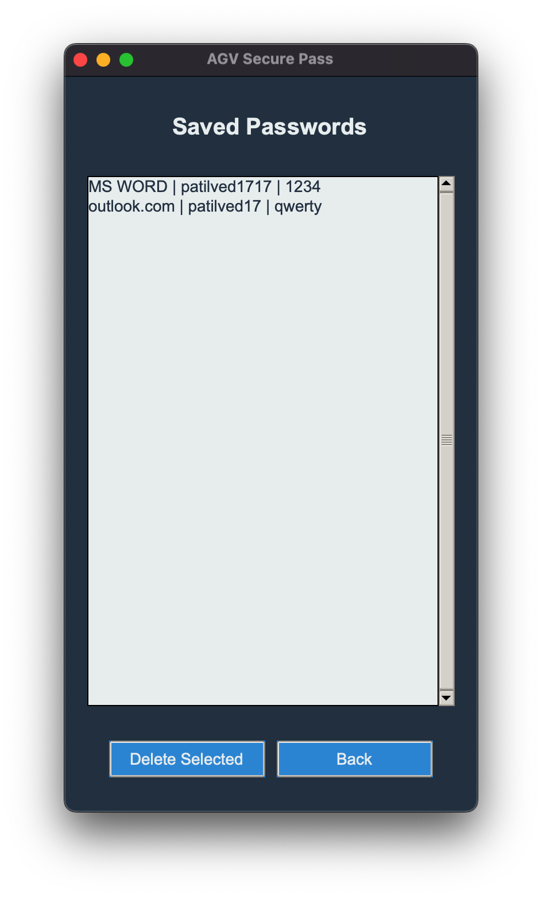
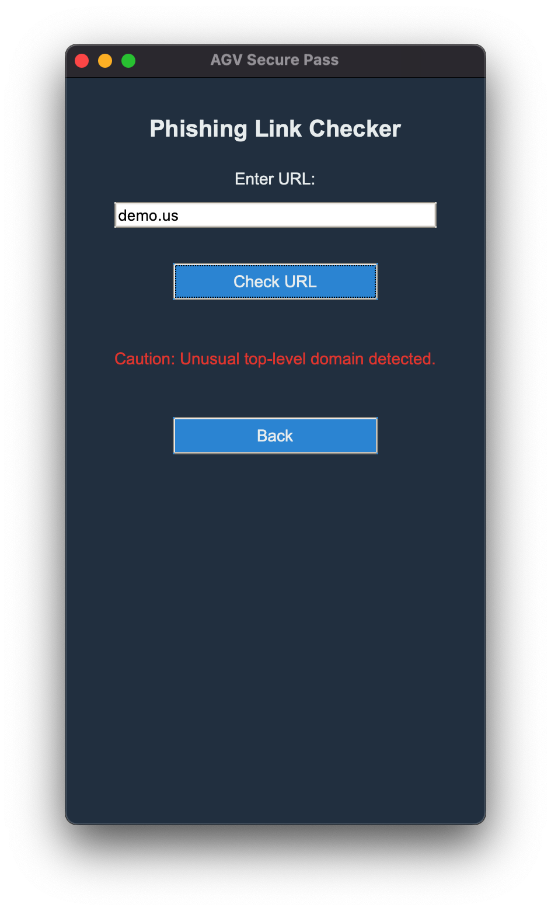

# AGV Secure Pass

AGV Secure Pass is a security application designed to help users manage their passwords securely and check for potential phishing links.

## Features
- **Password Manager:** Generate and save passwords securely.
- **Phishing Link Checker:** Check URLs for potential phishing risks.

## Screenshots

### 1. Login Screen


### 2. Selection Screen


### 3. Password Manager


### 4. Popup


### 5. Saved Passwords Screen


### 6. Phishing Link Checker


## Installation

1. Clone the repository:
    ```bash
    git clone https://github.com/yourusername/agv-secure-pass.git](https://github.com/vedant1717/AGV-Secure-Pass.git
    ```
2. Navigate to the project directory:
    ```bash
    cd agv-secure-pass
    ```
3. Install the required packages:
    ```bash
    pip install tkinter
    ```

## Usage

1. Run the application:
    ```bash
    python main.py
    ```

2. **Login Screen:** Enter the password "agvpm" to access the main features.
3. **Selection Screen:** Choose between "Password Manager" and "Phishing Link Checker."
4. **Password Manager:** Generate, save, and view passwords.
5. **Phishing Link Checker:** Enter a URL to check for phishing risks.

## Contributing

Contributions are welcome! Please fork the repository and submit a pull request for any enhancements or bug fixes.

## License

This project is licensed under the MIT License - see the [LICENSE](LICENSE) file for details.

## Contact

For any questions or suggestions, feel free to open an issue or contact me directly at patilved1717@gmail.com
